# APISIX + OPA Canary PoC

This project demonstrates a Canary Deployment routing strategy using APISIX and OPA (Open Policy Agent).
APISIX runs in Standalone mode using local `apisix.yaml` configuration.

## Architecture Diagram

```mermaid
flowchart TB
    subgraph "Client Requests"
        Client1["👤 Normal User<br/>(x-user-id: alice)"]
        Client2["👤 Beta User<br/>(x-user-id: beta_user)"]
    end
    
    subgraph "APISIX Gateway :9080"
        APISIX["🚪 APISIX<br/>Standalone Mode"]
        
        subgraph "Plugin Chain"
            direction TB
            Serverless["📝 serverless-pre-function<br/>Lua Script<br/>━━━━━━━━━━<br/>1. Extract x-user-id<br/>2. Call OPA API<br/>3. Parse routing decision<br/>4. Inject X-Target-Upstream header"]
            TrafficSplit["🔀 traffic-split<br/>━━━━━━━━━━<br/>If X-Target-Upstream = v2<br/>→ Route to Backend V2<br/>Else use default Backend V1"]
            
            Serverless --> TrafficSplit
        end
    end
    
    subgraph "Policy Engine :8181"
        OPA["🔐 OPA<br/>Open Policy Agent<br/>━━━━━━━━━━<br/>policy.rego<br/>━━━━━━━━━━<br/>Check x-user-id:<br/>• beta_user → inject v2 header<br/>• others → no extra headers"]
    end
    
    subgraph "Backend Services"
        V1["✅ Backend V1<br/>:8081<br/>Stable Version<br/>━━━━━━━━━━<br/>Response from V1 (Stable)"]
        V2["🧪 Backend V2<br/>:8082<br/>Canary Version<br/>━━━━━━━━━━<br/>Response from V2 (Canary)"]
    end
    
    Client1 -->|"GET /<br/>x-user-id: alice"| APISIX
    Client2 -->|"GET /<br/>x-user-id: beta_user"| APISIX
    
    APISIX --> Serverless
    
    Serverless -.->|"POST /v1/data/apisix/route<br/>{input: {request: {headers: {...}}}}"| OPA
    OPA -.->|"Normal: {allow: true}<br/>Beta: {allow: true, headers: {X-Target-Upstream: v2}}"| Serverless
    
    TrafficSplit -->|"No v2 header<br/>Use default route"| V1
    TrafficSplit -->|"Has X-Target-Upstream: v2<br/>Switch to Canary"| V2
    
    V1 -.->|"200 OK"| Client1
    V2 -.->|"200 OK"| Client2
    
    style Client1 fill:#e1f5ff,stroke:#01579b,stroke-width:2px
    style Client2 fill:#fff3e0,stroke:#e65100,stroke-width:2px
    style APISIX fill:#f3e5f5,stroke:#4a148c,stroke-width:3px
    style OPA fill:#e8f5e9,stroke:#1b5e20,stroke-width:2px
    style V1 fill:#e3f2fd,stroke:#0d47a1,stroke-width:2px
    style V2 fill:#fff8e1,stroke:#f57f17,stroke-width:2px
    style Serverless fill:#fce4ec,stroke:#880e4f,stroke-width:2px
    style TrafficSplit fill:#f1f8e9,stroke:#33691e,stroke-width:2px
```



## How It Works

### Normal User Flow (alice)
1. **Client** sends request `GET /` with header `x-user-id: alice`
2. **APISIX** receives request and executes `serverless-pre-function` plugin
3. **Serverless Lua** extracts `x-user-id` and calls **OPA** API
4. **OPA** evaluates policy.rego, finds `alice != beta_user`, returns `{allow: true}` (no extra headers)
5. **Serverless** does not inject any headers
6. **traffic-split** plugin checks for `X-Target-Upstream` header, finds none, uses default routing
7. Request is routed to **Backend V1** (upstream_id: 1)
8. **V1** returns `Response from V1 (Stable)`

### Beta User Flow (beta_user)
1. **Client** sends request `GET /` with header `x-user-id: beta_user`
2. **APISIX** receives request and executes `serverless-pre-function` plugin
3. **Serverless Lua** extracts `x-user-id` and calls **OPA** API
4. **OPA** evaluates policy.rego, finds `x-user-id == beta_user`, returns:
   ```json
   {
     "allow": true,
     "headers": {
       "X-Target-Upstream": "v2"
     }
   }
   ```
5. **Serverless** injects `X-Target-Upstream: v2` into request headers
6. **traffic-split** plugin detects `X-Target-Upstream == v2`, triggers routing rule
7. Request is routed to **Backend V2** (upstream_id: 2)
8. **V2** returns `Response from V2 (Canary)`

## Quick Start

1. **Start all services**:
   ```bash
   docker-compose up -d --build
   ```

2. **Check service status** (wait ~10-20 seconds for services to start):
   ```bash
   docker-compose ps
   ```

## Testing

**Scenario 1: Normal User → V1 (Stable)**
```bash
curl -H "x-user-id: alice" http://localhost:9080/
# Expected Output: Response from V1 (Stable)
```

**Scenario 2: Beta User → V2 (Canary)**
```bash
curl -H "x-user-id: beta_user" http://localhost:9080/
# Expected Output: Response from V2 (Canary)
```

## Technical Details

### Why Not Use Native OPA Plugin?
This PoC initially attempted to use APISIX's native `opa` plugin but encountered `503` errors. After testing:
- ✅ OPA service was reachable and functioning correctly
- ✅ OPA returned correct policy decisions
- ✅ Network connectivity was verified
- ❌ Native `opa` plugin consistently failed

**Solution**: Use `serverless-pre-function` (Lua) to directly call OPA HTTP API, providing:
- Complete error handling and logging
- Better debugging transparency
- More flexible header injection logic

### Key Configuration Files

- **[apisix/apisix.yaml](apisix/apisix.yaml)**: APISIX routing configuration and Lua script
- **[opa/policy.rego](opa/policy.rego)**: OPA routing decision logic
- **[docker-compose.yml](docker-compose.yml)**: Service orchestration

## Troubleshooting

**View APISIX logs**:
```bash
docker-compose logs -f apisix
```

**View OPA logs**:
```bash
docker-compose logs -f opa
```

**View Backend logs**:
```bash
docker-compose logs -f backend-v1
docker-compose logs -f backend-v2
```

**Test OPA directly**:
```bash
curl -X POST http://localhost:8181/v1/data/apisix/route \
  -H "Content-Type: application/json" \
  -d '{"input":{"request":{"headers":{"x-user-id":"beta_user"}}}}'
# Expected: {"result":{"allow":true,"headers":{"X-Target-Upstream":"v2"}}}
```

## Performance Metrics

Based on test report ([TRAFFIC_FLOW_TEST_REPORT.md](TRAFFIC_FLOW_TEST_REPORT.md)):
- OPA decision latency: ~0.25ms
- End-to-end latency: ~8ms
- Routing accuracy: 100%
- Zero failed requests

## Documentation

- [TEST_REPORT.md](TEST_REPORT.md) - Complete test report
- [TRAFFIC_FLOW_TEST_REPORT.md](TRAFFIC_FLOW_TEST_REPORT.md) - Traffic verification report
